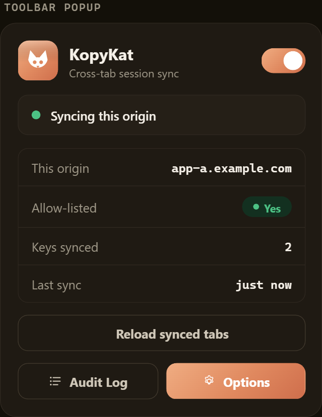
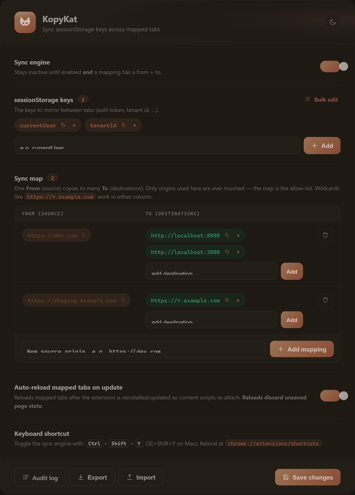
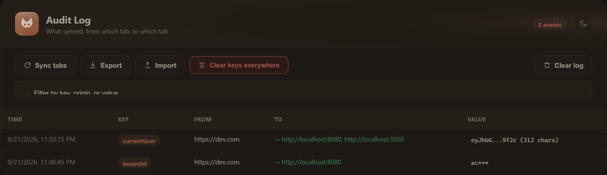
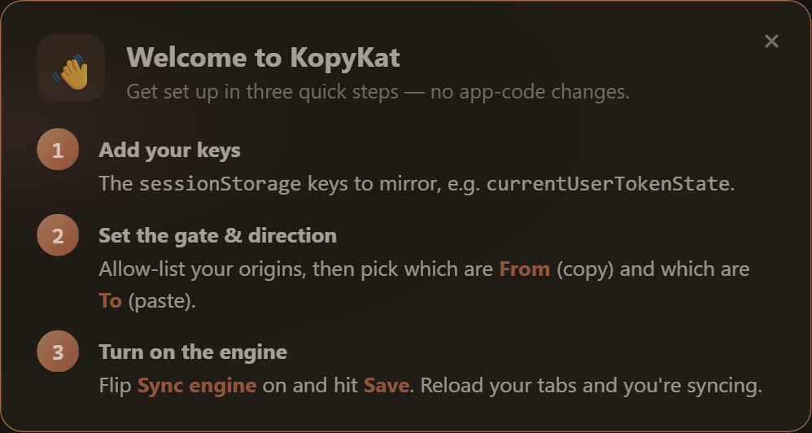

<div align="center">


# KopyKat

**Keep your session token in lock‑step across every app tab.**

Sign in once — every sibling app on your allow‑list picks up the token automatically, with **zero app‑code changes**.


</div>

---

## What it does

KopyKat mirrors chosen `sessionStorage` keys — like your `currentUser` token — across the exact origins you allow‑list. When one tab's value changes, every other open tab on an allow‑listed origin gets the same value written into its `sessionStorage`, instantly.

If your apps already read the token from `sessionStorage` on each request, **nothing in your app has to change** — KopyKat just keeps that key identical everywhere.

It stays **completely inactive** until you both enable the engine **and** allow‑list origins. Nothing is ever written to a site you didn't list.

---

## Screens

<div align="center">

### Toolbar popup


### Options


### Audit log


</div>

---

## Install (Chrome & Edge)

Both browsers use the same Manifest V3 build — one folder works for both.

1. Open `chrome://extensions` (or `edge://extensions`).
2. Turn on **Developer mode**.
3. Click **Load unpacked** and select this folder.
4. KopyKat's onboarding opens automatically on first install.

> Requires Chrome/Edge **111+** (for the MAIN‑world content script that powers instant sync).

---

## Configure

KopyKat uses a **sync map**: each rule copies a value **from** one source origin **to** many destinations. The map is also the allow‑list — only origins that appear in a rule are ever touched — so a value flows **from → to** only and the audit log reads cleanly as `https://dev.com → http://localhost:8080`.

1. Click the KopyKat icon → **Options** (onboarding opens automatically on first install).
2. Add the **sessionStorage keys** to sync (default: `currentUser`). Use **Bulk edit** to paste a whole comma/newline‑separated list.
3. Build the **sync map** — add a source origin, then add one or more destinations to it. Add as many rules as you need (N sources, each with N destinations). Wildcards are allowed:
   ```
   From: https://dev.com          To: http://localhost:8080, http://localhost:3000
   From: https://staging.example.com   To: https://*.example.com
   ```
4. Flip the **Sync engine** on and **Save**.
5. Reload the tabs in your map so the content script attaches (or use **Sync tabs** in the popup / audit page). New destination tabs auto‑sync on open.

<div align="center">

<br /><br />

</div>

---

## Features

**Sync engine**
- 🗺️ **From → To sync map** — one source maps to many destinations, many rules (many‑to‑many). The map is the allow‑list, and the audit log stays clean (`dev.com → localhost:8080`).
- ⚡ **Instant push sync** — a MAIN‑world script patches `sessionStorage.setItem` and broadcasts the moment a value changes; a 2.5 s poll is only a safety net.
- ⟳ **Auto‑sync on tab open** — a destination tab that loads missing or stale keys is filled in automatically (exact per‑key value compare, objects included).
- 🌐 **Wildcard origins** — `https://*.example.com` matches every subdomain, in either column.
- 🔁 **Auto‑reload mapped tabs** on update — plus a manual **Sync tabs** button.
- ⌨️ **Keyboard shortcut** — `Ctrl/⌘+Shift+Y` toggles the engine.

**Safety**
- 🔒 **Encrypted at rest** — cached values are AES‑GCM encrypted with a key kept only in memory (`storage.session`), so a disk/profile dump can't read them.
- 🛡️ **Default‑deny + masked audit** — off until you map origins; only real deliveries are logged, with a *masked* value preview (never the raw secret), last 50 events.
- 🧹 **Panic “clear everywhere”** — a warning dialog names the keys + destinations, then wipes them from every mapped tab.
- 💾 **Export / import config** — save your keys + sync map to JSON and load them on another machine.

**Experience**
- 📋 **Copy icons & bulk edit** — one‑click copy on every key/origin chip; Postman‑style bulk paste for keys.
- 😺 **State‑aware icon** — an awake terracotta cat when syncing, a sleeping gray cat when off.
- 🔢 **Toolbar badge** — shows engine state and flashes how many tabs each sync reached.
- 👋 **First‑run onboarding** — a short welcome walkthrough on install.
- 🌗 **Light & dark** across the popup, options, and audit views.

---

## Audit log

Open the popup → **Audit Log** (or Options → **Audit log**) to see every sync: timestamp, key, source origin, destination origin(s), and a masked value preview. Only real deliveries are recorded — no "no tab open" noise. Search/filter by key, origin, or value, and run **Sync tabs / Export / Import / Clear keys everywhere** right from the toolbar.

---

## Security notes

- Values are only ever displayed **masked** (a short prefix/suffix plus length).
- The at‑rest cache is **AES‑GCM encrypted**; the key lives in memory‑only session storage and is discarded on browser restart.
- Only exact origins, or the wildcard patterns you list, are ever read from or written to.
- Reloading the extension orphans already‑open tabs' content scripts — reload those tabs (auto‑reload does this for you on update).

---

## How it works

```
page writes sessionStorage  ──▶  inject.js (MAIN world) fires an event
        ▲                                   │
        │                                   ▼
   content.js writes           content.js reports the change
   incoming value        ◀──   to the background service worker
        ▲                                   │
        │                                   ▼
   other allow-listed tabs  ◀──  background rebroadcasts + logs an audit entry
```

---

## Development

```bash
# Regenerate the icon source SVGs (icons/kopykat*.svg)
node generate-icons.cjs
```

The shipped PNGs (`icons/icon{16,48,128}.png` and their `-off` gray variants) are rasterized from those SVGs. The toolbar swaps between the two sets by sync state.

### File layout

| File | Role |
|------|------|
| `manifest.json` | MV3 manifest (permissions, content scripts, command) |
| `inject.js` | MAIN‑world patch of `sessionStorage` for instant sync |
| `content.js` | Isolated content script: report changes, apply incoming values |
| `background.js` | Service worker: broadcast, audit, badge/icon, encryption, clear‑all |
| `common.js` | Shared defaults, wildcard origin matching, value masking |
| `popup.*` | Toolbar popup |
| `options.*` | Settings, export/import, onboarding |
| `audit.*` | Searchable sync audit log |
| `theme.css` | Shared design system (light + dark) |

---

## License

MIT © salilvnair
